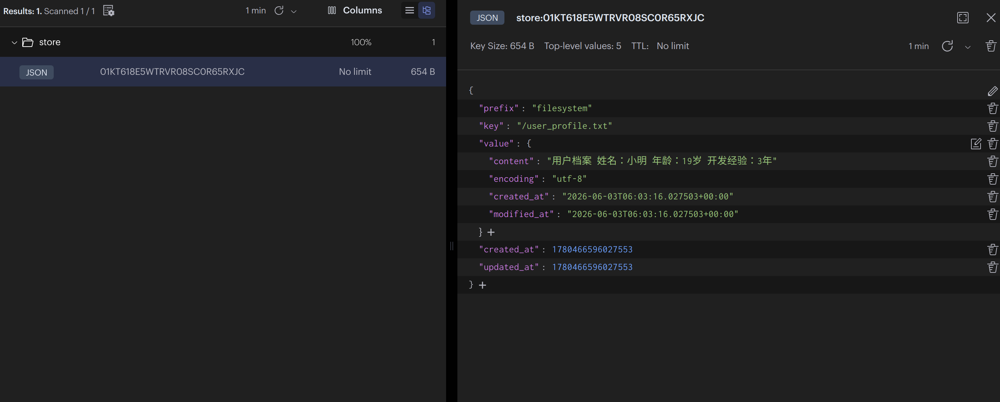
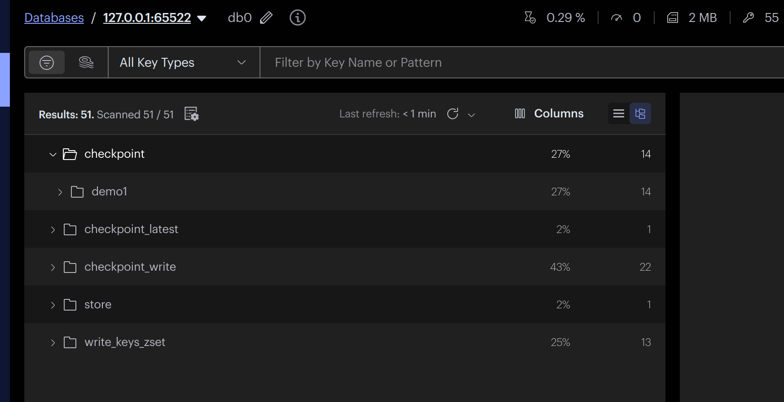

## 代码

- redisstore
```python
# @Time    : 2026/6/3 12:01
# @Author  : hero
# @File    : 16补充redisstore.py

'''
首先安装好包
(LLMlearn) nikofox@MOSS:~/LLMlearn/V1/gradio$ uv add langgraph-checkpoint-redis redis
Resolved 358 packages in 6.69s
Prepared 1 package in 716ms
Installed 1 package in 4ms
 + langgraph-checkpoint-redis==0.4.1

 并且第一次使用需要调用 store.setup() 创建索引。

本地启动 Redis，建议直接用 Redis Stack 或 Redis 8+。因为 LangGraph Redis Store 依赖 RedisJSON 和 RediSearch；Redis 8+ 默认包含这些模块，Redis 8 以下建议用 Redis Stack。
'''

from deepagents import create_deep_agent
from langgraph.checkpoint.memory import InMemorySaver
from langgraph.store.memory import InMemoryStore
from langgraph.store.redis import RedisStore #tips:使用redisstore
from langgraph.types import Command
from langchain.chat_models import init_chat_model
from deepagents.backends import StoreBackend
from dotenv import load_dotenv
import os

load_dotenv()

#StoreBackend 用于生产环境，跨Agent共享数据,持久化记忆(Redis/Postgres)


llm = init_chat_model(
    model='glm-4.7',
    model_provider='openai',
    api_key=os.getenv('zhipu_key'),
    base_url=os.getenv('zhipu_base_url')
)
#准备Store(模拟数据库)
## InMemoryStore是轻量级内存存储，重启后数据丢失
#最终存储的位置 内存的k=v 使用langgraph自带的,也可以换成其它的
store=InMemoryStore() #tips:也可以不用内存存储,换成数据库也是可以的,可以回看langgraph高级特性中的02中的05


#important:设置redisstore ,它智能用0号库
REDIS_URI=os.getenv('REDIS_DOCKER0')

with RedisStore.from_conn_string(REDIS_URI) as redis_store:
    redis_store.setup()

    #创建main_agent
    main_agent=create_deep_agent(
        model=llm,
        tools=[],
        store=redis_store,#tips:注意这里
        backend=StoreBackend(), #tips:开启k=v库存储 important:触发store的前提是backend要指定为StoreBackend,新版本建议直接传实例StoreBackend()
        system_prompt="你要把用户的重要信息保存到user_profile.txt文件中!!"
    )

    #演示跨会话，跨线程进行长期记忆
    config_a={
        "configurable":{
            "thread_id":"demo1"
        }
    }

    config_b={
        "configurable":{
            "thread_id":"demo2"
        }
    }

    #第一次执行,存储一些信息
    result_a = main_agent.invoke(
        {
            "messages":[
                {
                    "role":"user",
                    "content":"今年小明19岁，已经有三年开发经验"
                }
            ]
        },
        config=config_a
    )

    print(f"第一次执行结果{result_a['messages'][-1].content}")

    #important:读取store中的内容，看看是不是真的存进去了
    # 这里要查redis_store而不是原来的InMemoryStore
    items = redis_store.search('filesystem',) #tips: StoreBackend 默认把文件系统内容放在 ("filesystem",) 这个 namespace 下
                                              #  namespace 是 LangGraph Store 的逻辑命名空间，不等于数据库名称
    for item in items:
        print(f'k={item.key},v={item.value}')

    #tips：第二次执行,换thread_id,但仍然能读取到长期store

    result_b = main_agent.invoke(
        {
            "messages":[
                {
                    "role":"user",
                    "content":"小明几岁了?有几年开发经验?"
                }
            ]
        },
        config=config_b
    )
    print(f"第二次返回结果{result_b['messages'][-1].content}")
    '''
    /home/nikofox/.local/bin/uv run /home/nikofox/LLMlearn/.venv/bin/python /home/nikofox/LLMlearn/V1/DeepAgents/code/16补充redisstore.py 
    第一次执行结果已将小明的信息保存到 user_profile.txt 文件中。
    第二次返回结果小明19岁，有3年开发经验。
    '''

#tips:redis数据库中的结果可以查看note下的01.png
```


- redisstore和redissaver配合
```python
# @Time    : 2026/6/3 14:08
# @Author  : hero
# @File    : 17redisstore与redissaver配合.py


'''
如果你后面还想把 对话线程状态 也放到 Redis，而不只是长期文件 Store，那么再加 RedisSaver
'''
from deepagents import create_deep_agent
from deepagents.backends import StoreBackend
from langchain.chat_models import init_chat_model
from langgraph.store.redis import RedisStore
from langgraph.checkpoint.redis import RedisSaver #tips:引入redissaver
from dotenv import load_dotenv
import os

load_dotenv()

llm = init_chat_model(
    model="glm-4.7",
    model_provider="openai",
    api_key=os.getenv("zhipu_key"),
    base_url=os.getenv("zhipu_base_url"),
)

REDIS_URI = os.getenv("REDIS_DOCKER0")

if not REDIS_URI:
    raise ValueError("请先在 .env 中配置 REDIS_DOCKER，例如 redis://localhost:6379")

with RedisStore.from_conn_string(REDIS_URI) as redis_store, \
     RedisSaver.from_conn_string(REDIS_URI) as checkpointer:

    redis_store.setup()
    checkpointer.setup()

    main_agent = create_deep_agent(
        model=llm,
        tools=[],
        store=redis_store,              # 长期记忆，例如 user_profile.txt
        checkpointer=checkpointer,      # 短期线程状态，例如 thread_id 对话历史
        backend=StoreBackend(),
        system_prompt="你要把用户的重要信息保存到/memories/user_profile.txt文件中!!",
    )

    config_a = {
        "configurable": {
            "thread_id": "demo1"
        }
    }

    result = main_agent.invoke(
        {
            "messages": [
                {
                    "role": "user",
                    "content": "今年小红21岁，已经有三年开发经验"
                }
            ]
        },
        config=config_a,
    )

    print(result["messages"][-1].content)

    items = redis_store.search(("filesystem",))

    for item in items:
        print(f"k={item.key}, v={item.value}")

'''
已保存用户信息到 /memories/user_profile.txt 文件。
k=/user_profile.txt, v={'content': '用户档案\n\n姓名：小明\n年龄：19岁\n开发经验：3年', 'encoding': 'utf-8', 'created_at': '2026-06-03T06:03:16.027503+00:00', 'modified_at': '2026-06-03T06:03:16.027503+00:00'}
k=/memories/user_profile.txt, v={'content': '用户信息：\n- 姓名：小红\n- 年龄：21岁\n- 工作经验：3年开发经验', 'encoding': 'utf-8', 'created_at': '2026-06-03T06:17:24.285188+00:00', 'modified_at': '2026-06-03T06:17:24.285188+00:00'}'''
```

你现在说的 `filesystem` 其实是 **StoreBackend 默认使用的 namespace**：

```python id="hr5c00"
redis_store.search(("filesystem",))
```


它不是数据库名，也不是 Redis key 的完整名字，而是 LangGraph Store 里的**逻辑命名空间**。

---

## 1. 最简单：文件名可以随便换

比如你现在让 Agent 写：

```text id="4kps1a"
user_profile.txt
```

你完全可以改成：

```text id="pnfdra"
xiaoming_profile.txt
```

例如：

```python id="molbbi"
system_prompt="你要把用户的重要信息保存到xiaoming_profile.txt文件中!!"
```

那么后面查出来可能就是：

```text id="cemoo4"
k=/xiaoming_profile.txt
```

这个最简单，不需要改 backend。

---

## 2. `filesystem` 这个 namespace 能不能换？

理论上可以，但**不建议你直接硬改 DeepAgents 默认的 `filesystem` namespace**。

DeepAgents 的 `StoreBackend` 是把文件系统工具，例如 `ls`、`read_file`、`write_file`、`edit_file`、`glob`、`grep`，映射到底层 backend 里的。官方文档里说明 Deep Agents 暴露的是一个 filesystem surface，后端可以用 `StoreBackend()`、`FilesystemBackend`、`CompositeBackend` 等方式接入。([LangChain 文档][1])

默认情况下，`StoreBackend` 会把这些虚拟文件存在 `("filesystem",)` 这个 namespace 下面。你平时只要知道它默认这样放就行。

---

## 3. 更推荐的方式：用路径名区分，而不是改 namespace

比如你可以让 Agent 存到：

```text id="ltqi6x"
/memories/user_profile.txt
```

或者：

```text id="pqdoae"
/profiles/xiaoming.txt
```

然后配合 `CompositeBackend` 做路径路由。

DeepAgents 官方文档提到，`CompositeBackend` 可以把不同路径 route 到不同 backend，例如把 `/memories/` 路由到 `StoreBackend()`。([GitHub][2])

例如：

```python id="c2hiam"
from deepagents.backends import CompositeBackend, StateBackend, StoreBackend

backend = CompositeBackend(
    default=StateBackend(),
    routes={
        "/memories/": StoreBackend(),
    },
)

main_agent = create_deep_agent(
    model=llm,
    tools=[],
    store=redis_store,
    backend=backend,
    system_prompt="你要把用户的重要信息保存到 /memories/user_profile.txt 文件中!!",
)
```

这样 Agent 写入：

```text id="11dfw7"
/memories/user_profile.txt
```

就会走 `StoreBackend()`，也就是 RedisStore。

这种方式比改 `filesystem` namespace 更清晰。

---

## 4. 你真正应该怎么写？

如果你的目的只是区分不同用户，我建议不要改 `filesystem`，而是改文件路径：

```python id="bybrf9"
system_prompt="""
你要把用户的重要信息保存到 /memories/user_profile.txt 文件中。
如果是小明的信息，就保存到 /memories/xiaoming_profile.txt。
"""
```

读取时调试可以这样：

```python id="qm1mcm"
items = redis_store.search(("filesystem",))

for item in items:
    print(item.key, item.value)
```

你会看到类似：

```text id="3wdbmh"
/memories/user_profile.txt
/memories/xiaoming_profile.txt
```

---

## 5. 如果是多用户系统，推荐这样设计

比如你以后做 Web 后端，每个用户一个 `user_id`：

```python id="zaks44"
user_id = "user_001"

system_prompt = f"""
你要把当前用户的重要信息保存到 /users/{user_id}/profile.txt 文件中。
以后读取用户信息时，也优先读取 /users/{user_id}/profile.txt。
"""
```

然后 Agent 写入：

```text id="drdad3"
/users/user_001/profile.txt
```

这样比改 namespace 更适合生产环境。

因为：

```text id="6qckij"
namespace = filesystem
key       = /users/user_001/profile.txt
```

逻辑上更清楚。

---

## 6. 总结

可以换，但要看你换什么：

| 你想换的东西                             |                 能不能换 | 推荐程度 |
| ---------------------------------- | -------------------: | ---: |
| `user_profile.txt` 文件名             |                   可以 | 强烈推荐 |
| `/memories/`、`/users/user_001/` 路径 |                   可以 | 强烈推荐 |
| `filesystem` namespace             |          可以想办法改，但不建议 |  不推荐 |
| Redis 数据库名                         | 和 `filesystem` 不是一回事 |  不相关 |

你现在最推荐这样改：

```python id="og3fa9"
system_prompt="你要把用户的重要信息保存到 /memories/user_profile.txt 文件中!!"
```

然后调试仍然用：

```python id="sfv7ye"
items = redis_store.search(("filesystem",))
```

因为 `filesystem` 是 DeepAgents 默认的虚拟文件系统命名空间，不是你业务里的“文件夹名”。

[1]: https://docs.langchain.com/oss/python/deepagents/backends?utm_source=chatgpt.com "Backends - Docs by LangChain"
[2]: https://github.com/langchain-ai/deepagents/blob/master/libs/deepagents/deepagents/middleware/filesystem.py?utm_source=chatgpt.com "filesystem.py"
