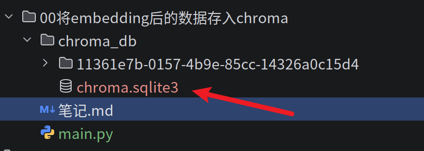
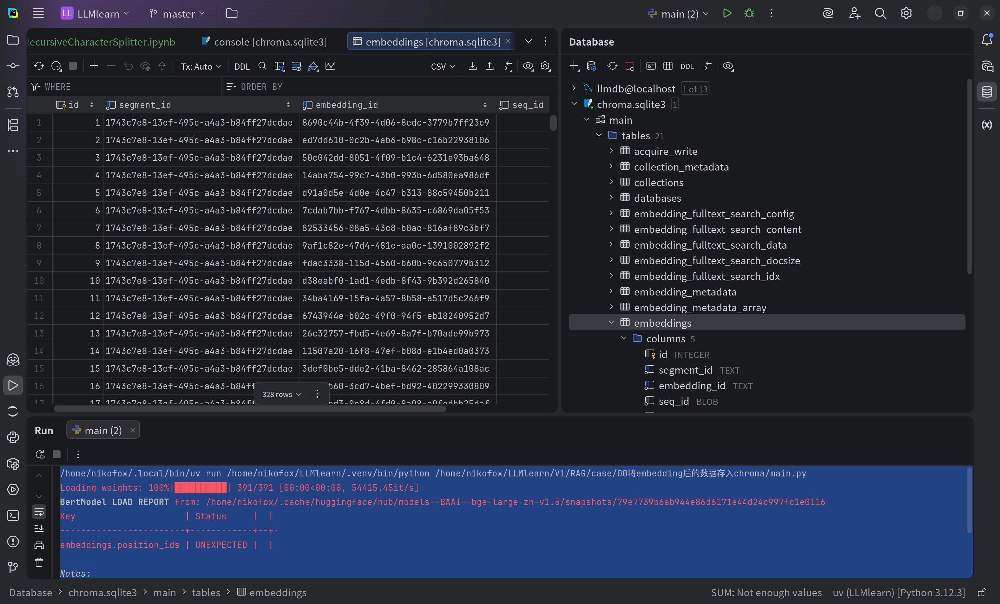

# 初体验Chroma

## 明确要干的事情

>使用非结构化docx文档加载器调用.load()之后返回的是一个结构化的文档列表,而且默认指定的是single模式,所以只会有一个元素,
>但是这样还是不够精细的,所以用切分器将其切分,然后得到的是切分后的列表,这样之后元素可就多了,这个列表变得不再单一,而是切分出了多块儿元素  
>之后还需要定义一个返回模型的函数并最终构建存入chroma的函数,传入分割后的结构化文档列表,然后传入embedding模型,并传入db路径
>这之后将会把文档embedding后的数据存入指定路径下并生成db文件(sqlite)   
>


## 划分
- 构造加载器函数
- 构造分词器函数
- 构造模型实例化函数
- 构造保存至chroma函数

0. 需要的包以及模型的路径
```python
from langchain_chroma import Chroma
import torch
from langchain_huggingface import HuggingFaceEmbeddings
from langchain_community.document_loaders import UnstructuredWordDocumentLoader
from langchain_text_splitters import RecursiveCharacterTextSplitter
MODEL_PATH = '/home/nikofox/.cache/huggingface/hub/models--BAAI--bge-large-zh-v1.5/snapshots/79e7739b6ab944e86d6171e44d24c997fc1e0116'


```
1. 构造加载器函数
```python
#tips:定义文档加载器,返回结构化后的文档结果
def docloader(doc_path):
    return UnstructuredWordDocumentLoader(file_path=doc_path,mode='single').load()

```
2. 构造分词器函数 
```python

def spliter(docs,chunk_size=400,chunk_overlap=50):
    return RecursiveCharacterTextSplitter(
        separators=['\n\n', '\n', '。', '！', '？', '……', '，', ''],  # tips:分割符列表,按顺序切分，现用句号切分，然后是感叹号，然后问号,然后省略号，然后逗号，然后空
        chunk_size=chunk_size,  # 每个块儿的最大长度
        chunk_overlap=chunk_overlap,  # tips:每个块重叠的长度
        length_function=len,  # tips:可选,计算文本长度的函数，默认为字符串长度,可以自定义函数来实现token数切分
        add_start_index=True  # tips:可选,块的元数据中添加如此块起始索引
    ).split_documents(docs)
```
3. 构造模型实例化函数 
```python
#tips：定义Embedding功能,返回构建的嵌入模型

def embed_model(model_path=MODEL_PATH):
    return HuggingFaceEmbeddings(
    model_name=model_path,
    model_kwargs={
        'device':'cuda:0' if torch.cuda.is_available() else 'cpu'
    }
)

```
4. 构造保存至chroma函数
```python
def save2chroma(documents,embed_model,save_path):
    vectorstore = Chroma.from_documents(
        documents=documents, #tips:接受一个文档切分后的列表
        embedding=embed_model, #tips 传入一个embedding模型
        persist_directory=save_path #tips:传入db文件要保存的路径
    )
    print(f'向量库已经保存至{save_path}🎉')
    return vectorstore

```

5. 主函数

```python
if __name__ == '__main__':
    doc_pth = '../../assets/sample.docx'
    docs = docloader(doc_pth) #tips:先将其转换为结构化数据
    splited_res = spliter(docs,chunk_size=400,chunk_overlap=50) #tips:然后再进行分词
    target_embed_model=embed_model() #tips:实例化embedding模型
    vector_db = save2chroma( #tips:存入chroma
        documents=splited_res,
        embed_model=target_embed_model,
        save_path='./chroma_db'

    )
```

**运行结果**  

```shell
/home/nikofox/.local/bin/uv run /home/nikofox/LLMlearn/.venv/bin/python /home/nikofox/LLMlearn/V1/RAG/case/00将embedding后的数据存入chroma/main.py 
Loading weights: 100%|██████████| 391/391 [00:00<00:00, 54415.45it/s]
BertModel LOAD REPORT from: /home/nikofox/.cache/huggingface/hub/models--BAAI--bge-large-zh-v1.5/snapshots/79e7739b6ab944e86d6171e44d24c997fc1e0116
Key                     | Status     |  | 
------------------------+------------+--+-
embeddings.position_ids | UNEXPECTED |  | 

Notes:
- UNEXPECTED	:can be ignored when loading from different task/architecture; not ok if you expect identical arch.
向量库已经保存至./chroma_db🎉

```





## 测试

**利用chroma进行语义搜索**  

1. 导包并加载模型
```python
from langchain_chroma import Chroma
from langchain_huggingface import HuggingFaceEmbeddings
import torch

MODEL_PATH = '/home/nikofox/.cache/huggingface/hub/models--BAAI--bge-large-zh-v1.5/snapshots/79e7739b6ab944e86d6171e44d24c997fc1e0116'
embedding_model = HuggingFaceEmbeddings(
    model_name=MODEL_PATH,
    model_kwargs={'device': 'cuda:0' if torch.cuda.is_available() else 'cpu'}
)
```
2. 加载并实例化向量数据库
```python
# 直接加载已有向量库 无需重新嵌入,
# 之前的时候是用pandas来构造一个输入和embedding数据的余弦相似度计算,而且事先自己还需要将输入进行embedding然后给数据单独开一列进行排序然后拿到top_k,
vector_db = Chroma(
    persist_directory="./chroma_db",
    embedding_function=embedding_model
)
```
3. 语义搜索，使用相似度搜索
```python
results = vector_db.similarity_search("不动产物权的设立", k=2)
for i, doc in enumerate(results):
    print(f"【结果 {i+1}】\n{doc.page_content[:200]}...\n来源: {doc.metadata}\n")
```
4. 查看结果
```shell
Loading weights: 100%|██████████| 391/391 [00:00<00:00, 42646.54it/s]
BertModel LOAD REPORT from: /home/nikofox/.cache/huggingface/hub/models--BAAI--bge-large-zh-v1.5/snapshots/79e7739b6ab944e86d6171e44d24c997fc1e0116
Key                     | Status     |  | 
------------------------+------------+--+-
embeddings.position_ids | UNEXPECTED |  | 

Notes:
- UNEXPECTED	:can be ignored when loading from different task/architecture; not ok if you expect identical arch.
【结果 1】
第二百零七条　国家、集体、私人的物权和其他权利人的物权受法律平等保护，任何组织或者个人不得侵犯。

第二百零八条　不动产物权的设立、变更、转让和消灭，应当依照法律规定登记。动产物权的设立和转让，应当依照法律规定交付。

第二章　物权的设立、变更、转让和消灭

第一节　不动产登记

第二百零九条　不动产物权的设立、变更、转让和消灭，经依法登记，发生效力；未经登记，不发生效力，但是法律另有规定的除外。...
来源: {'source': '../../assets/sample.docx', 'start_index': 18707}

【结果 2】
第二百三十条　因继承取得物权的，自继承开始时发生效力。

第二百三十一条　因合法建造、拆除房屋等事实行为设立或者消灭物权的，自事实行为成就时发生效力。

第二百三十二条　处分依照本节规定享有的不动产物权，依照法律规定需要办理登记的，未经登记，不发生物权效力。

第三章　物权的保护

第二百三十三条　物权受到侵害的，权利人可以通过和解、调解、仲裁、诉讼等途径解决。

第二百三十四条　因物权的归属、内...
来源: {'source': '../../assets/sample.docx', 'start_index': 20473}
```