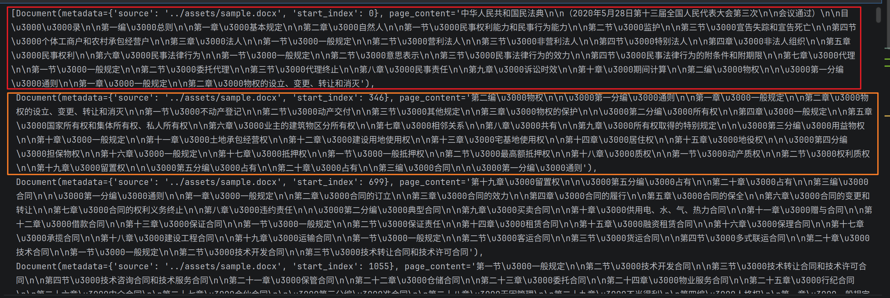

## 我先自己总结并附带上让ai帮我细致解释的部分

> 先看我构建的提示词模板  
> 我构建三个模板,一个是上下文，一个是对话历史，一个是用户提问    
> 所以传入的时候是必须有这三个部分的  
> 但是输入问题的时候输入的是字典`{'user_quiz':user_input}`,所以接下来的思路一定要清晰  
> **retriver**它只接受字符串输入，所以我们需要利用operator中的itemgetter拿出键对应的值    
> 这样就拿出了user_quiz对应的字符串,然后将这个字符串交给retriver,retriver就会用我们的问题   
> 去向量数据库中检索，指定的retriver的k值为3,就找出最匹配的三条，但是注意，一开始学rag的时候   
> 学到的retriver返回的是Document对象列表，我拿09RecursiveCharacterSplitter中的输出举例    
>   
> 那么现在问题来了，我们要传入字符串给prompt_template,所以我们要从这些对象中提取出我们需要的page_content, 
> 又因为我们用的是k值为3,所以需要遍历document对象并且取出每个对象中的page_content,然后将其拼接为一个大字符串  
> 用双换行符分隔，这就是` lambda docs: "\n\n".join([d.page_content for d in docs])`的作用  
> 然后context部分就构造好了，之后便是拿出构建user_quiz字典和history字典，之后将这些传入提示词模板中就可以
```python 
prompt_template = ChatPromptTemplate(
    [('system','你是一个法律顾问助手,请根据上下文回答问题'),
    ('system','上下文{context}'),
    MessagesPlaceholder(variable_name='history'),
    ('human','{user_quiz}')]
)

# Define a function to format the retrieved documents important:或者直接把这个公布功能给提出来
def format_docs(docs):
    return "\n\n".join(doc.page_content for doc in docs)

#important:仔细看chain！！！！！
rag_chain = (
    {
        "context": itemgetter("user_quiz") | retriver | (
            lambda docs: "\n\n".join([d.page_content for d in docs])
        ),
        "user_quiz": itemgetter("user_quiz"),
        "history": itemgetter("history")   # 必须加这一行！！不然出莱格式文体
    }
    | prompt_template
    | llm
    | StrOutputParser()
)
#.....省略  
			#.......
            result = chain_with_history.invoke(
                {'user_quiz': user_input}, config
            )

            print(f"\n✅ {result}\n")

        except Exception as e:
            logger.error(e)

if __name__ == '__main__':
    chat_loop()
```


----------------------
让我来详细解释一下这个代码中的 `rag_chain` 部分。

首先，我需要查看这段代码的具体实现：好的，我来详细解释一下代码中的 `rag_chain` 部分。这是整个RAG（检索增强生成）系统的核心部分。

```python
rag_chain = (
    {
        "context": itemgetter("user_quiz") | retriver | (
            lambda docs: "\n\n".join([d.page_content for d in docs])
        ),
        "user_quiz": itemgetter("user_quiz"),
        "history": itemgetter("history")   # 必须加这一行！！不然出莱格式文体
    }
    | prompt_template
    | llm
    | StrOutputParser()
)
```

让我逐层解析这个链式结构：

### 1. 输入字典映射部分
```python
{
    "context": itemgetter("user_quiz") | retriver | (lambda docs: "\n\n".join([d.page_content for d in docs])),
    "user_quiz": itemgetter("user_quiz"),
    "history": itemgetter("history")
}
```

这部分创建了一个字典，将输入数据重新组织成适合后续处理的格式：

- **`itemgetter("user_quiz")`**: 从输入中提取用户问题
- **`| retriver`**: 将用户问题传递给检索器(retriver)，检索器会在向量数据库中搜索与问题相关的文档
- **`| (lambda docs: "\n\n".join([d.page_content for d in docs]))`**: 对检索到的文档进行格式化，将多个文档的内容连接成一个字符串，每个文档之间用双换行符分隔
- **`"user_quiz"`**: 直接将原始用户问题传递下去
- **`"history"`**: 传递对话历史记录

### 2. 整体执行流程

整个 `rag_chain` 的执行流程如下：

1. **接收输入**：接收包含 `user_quiz`（用户问题）和 `history`（对话历史）的字典
2. **并行处理**：
   - 提取用户问题并传给检索器，获取相关的文档片段
   - 直接传递用户问题和对话历史
3. **组合数据**：将检索到的上下文、用户问题和历史记录组合成一个字典
4. **模板填充**：将组合后的数据填入预定义的提示词模板中
5. **大模型推理**：将填充后的提示词发送给大语言模型(llm)
6. **输出解析**：将模型返回的结果解析为字符串

### 3. RAG的工作原理

这个链的核心思想是：

- **检索**：当用户提出问题时，先在知识库中检索相关的文档片段
- **增强**：将检索到的相关信息作为上下文(context)添加到提示词中
- **生成**：让大语言模型基于这个增强的上下文来生成回答

这样做的好处是：
- 减少模型的幻觉现象（因为模型的回答基于真实的文档）
- 让模型能够回答关于特定领域或私有数据的问题
- 无需重新训练模型就能扩展其知识范围

### 4. 为什么这样设计

这种设计使用了LangChain的LCEL（LangChain Expression Language），允许我们以声明式的方式构建复杂的链式处理流程。各个组件可以独立开发和测试，同时又能无缝集成在一起。

希望这个解释能帮助您更好地理解 `rag_chain` 的工作原理！