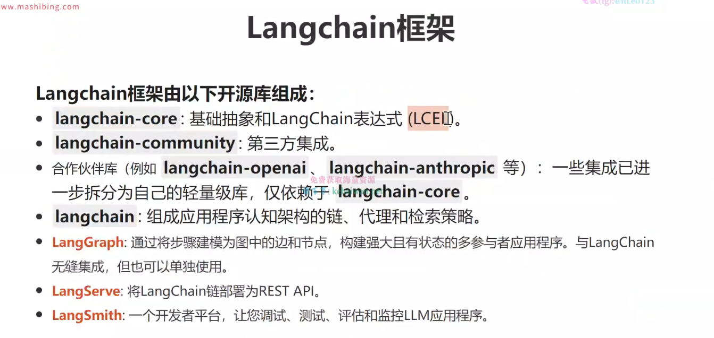
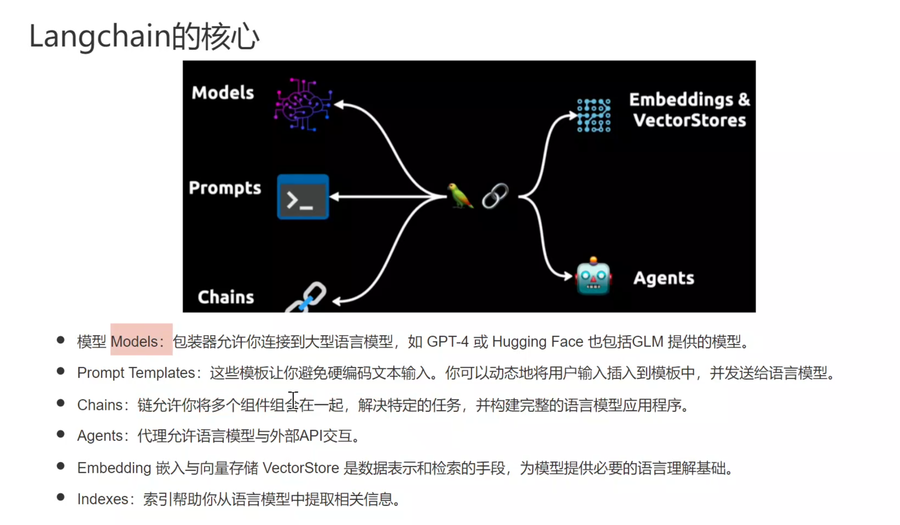

# Langchain框架

##  介绍
Langchain是一个用于开发由大语言模型(LLMs)驱动的应用程序的框架
它简化了LLM应用程序生命周期的每个阶段:
- 开发:使用`LangChain`的开源构建`模块`、`组件`、和`第三方集成`构建自己的应用程序，使用`LangGraph` 
构建具有一流流式处理和人机协作支持的有状态代理。
- 生产化:使用`LangSmith`检查、监控和评估您的`链`,以便您可以持续优化并自信部署
- 部署:将您的`LangGraph`应用程序转变为生产就绪的API和助手，使用`LangGraph Cloud`

**Langchain框架由以下开源库组成**

**核心**

