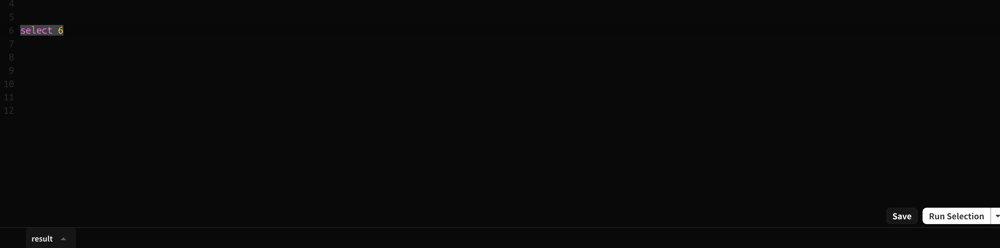
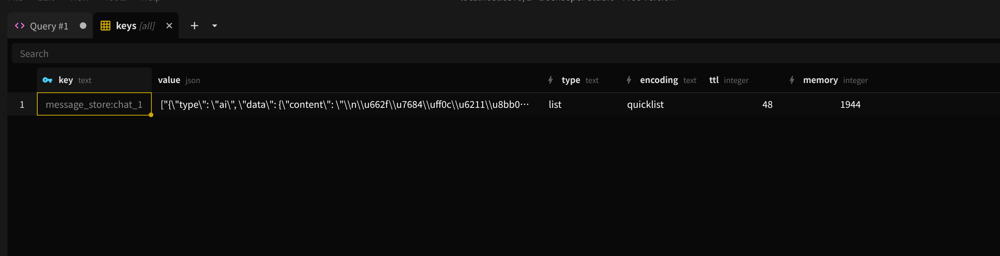
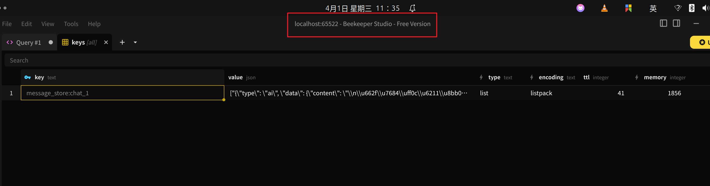
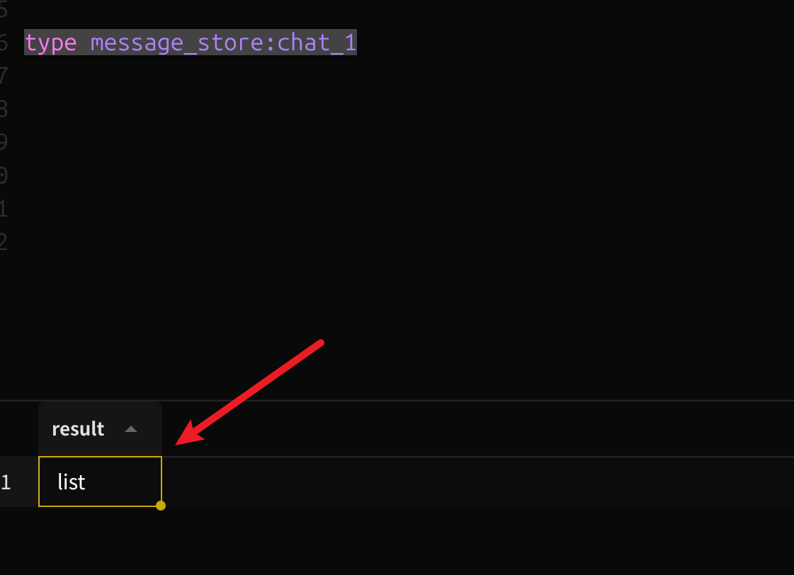
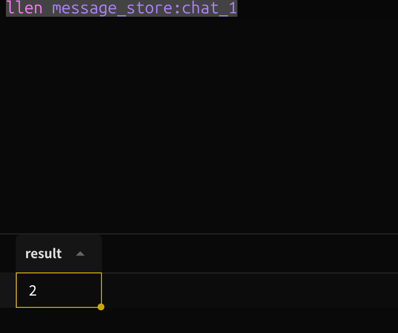

# 记忆缓存redis版本

关键就是`RunnableWithMessageHistory`实例的实现以及  
`get_session_history`的实现

```python
# @Time    : 2026/3/31 22:38
# @Author  : hero
# @File    : 25记忆缓存redis版.py

from langchain_community.chat_message_histories import RedisChatMessageHistory
from langchain_core.runnables import RunnableConfig
from langchain_core.runnables.history import RunnableWithMessageHistory
from langchain_openai import ChatOpenAI
from langchain_core.prompts import ChatPromptTemplate,MessagesPlaceholder
from langchain_core.output_parsers import StrOutputParser
from dotenv import load_dotenv
import os
load_dotenv()

zai_key = os.getenv('zhipu_key')
zai_url = os.getenv('zhipu_base_url')


llm_glm=ChatOpenAI(
    model='glm-4',
    api_key=zai_key,
    base_url=zai_url
)

prompt_template = ChatPromptTemplate(
    messages=[
        ('system','你现在是一心理专家'),
        MessagesPlaceholder(variable_name='history'),
        ('human','{user_input}')
    ]
)

parser = StrOutputParser()

chain=prompt_template|llm_glm|parser


#------从接下来这一块儿开始便是实现的方式了---------
REDIS_URL='redis://127.0.0.1:6379/6'
def get_session_history(session_id:str):
    return RedisChatMessageHistory(
        session_id=session_id,
        url=REDIS_URL,
        ttl=120 #tips:设置两分钟之后过期

    )

runnable_with_redis = RunnableWithMessageHistory(
    chain,
    get_session_history,
    input_messages_key='user_input',
    history_messages_key='history'
)

#-----------------------------
config = RunnableConfig(configurable={'session_id':'chat_1'})


resp1 = runnable_with_redis.invoke(
    {'user_input':'你好啊,我是hero，你叫什么名字?'},
    config
)

print(resp1)

print('***'*20)

resp2 = runnable_with_redis.invoke(
    {'user_input':'你还记得我叫什么名字么?'},
    config
)
print(resp2)
```
由于选择的是6号数库,就得先选到6号库，而且设置了过期时间,可以看到剩下48s了，之后刷新已经没有了




## docker redis/redis-stack-server版

```shell
nikofox@MOSS:/etc/docker$ docker images
                                                                                                                                   i Info →   U  In Use
IMAGE                             ID             DISK USAGE   CONTENT SIZE   EXTRA
redis/redis-stack-server:latest   798ab84d9f26        834MB          298MB        
nikofox@MOSS:/etc/docker$ docker run -d -p 65522:6379 798ab
c002f34ce295472190b5f73ad1cd88bd6c79bf1c749914810212ede726a60cc9
nikofox@MOSS:/etc/docker$ docker images
                                                                                                                                   i Info →   U  In Use
IMAGE                             ID             DISK USAGE   CONTENT SIZE   EXTRA
redis/redis-stack-server:latest   798ab84d9f26        834MB          298MB    U   
nikofox@MOSS:/etc/docker$ docker ps
CONTAINER ID   IMAGE     COMMAND            CREATED         STATUS         PORTS                                           NAMES
c002f34ce295   798ab     "/entrypoint.sh"   9 seconds ago   Up 8 seconds   0.0.0.0:65522->6379/tcp, [::]:65522->6379/tcp   vigorous_margulis
nikofox@MOSS:/etc/docker$ 

```
就换一下url就行
```python
# @Time    : 2026/3/31 22:38
# @Author  : hero
# @File    : 25记忆缓存redis版.py

from langchain_community.chat_message_histories import RedisChatMessageHistory
from langchain_core.runnables import RunnableConfig
from langchain_core.runnables.history import RunnableWithMessageHistory
from langchain_openai import ChatOpenAI
from langchain_core.prompts import ChatPromptTemplate,MessagesPlaceholder
from langchain_core.output_parsers import StrOutputParser
from dotenv import load_dotenv
import os
load_dotenv()

zai_key = os.getenv('zhipu_key')
zai_url = os.getenv('zhipu_base_url')


llm_glm=ChatOpenAI(
    model='glm-4',
    api_key=zai_key,
    base_url=zai_url
)

prompt_template = ChatPromptTemplate(
    messages=[
        ('system','你现在是一心理专家'),
        MessagesPlaceholder(variable_name='history'),
        ('human','{user_input}')
    ]
)

parser = StrOutputParser()

chain=prompt_template|llm_glm|parser
#------从接下来这一块儿开始便是实现的方式了---------
# REDIS_URL='redis://127.0.0.1:6379/6'
REDIS_URL='redis://127.0.0.1:65522/6' #tips:测试docker redis/redis-stack-server
def get_session_history(session_id:str):
    return RedisChatMessageHistory(
        session_id=session_id,
        url=REDIS_URL,
        ttl=120 #tips:设置两分钟之后过期

    )

runnable_with_redis = RunnableWithMessageHistory(
    chain,
    get_session_history, #important:这里是必须要指定的,不然就无法根据sessionid来获取同一sessionid的上文
    input_messages_key='user_input',
    history_messages_key='history'
)

# -------------------------------------------
config = RunnableConfig(configurable={'session_id':'chat_1'})


resp1 = runnable_with_redis.invoke(
    {'user_input':'你好啊,我是hero，你叫什么名字?'},
    config
)

print(resp1)

print('***'*20)

resp2 = runnable_with_redis.invoke(
    {'user_input':'你还记得我叫什么名字么?'},
    config
)
print(resp2)
```



## 持续对话版  

```python
# @Time    : 2026/4/1 11:41
# @Author  : hero
# @File    : 26记忆缓存持续对话版.py
import asyncio

from langchain_core.prompts import ChatPromptTemplate,MessagesPlaceholder
from langchain_core.output_parsers import StrOutputParser
from langchain_core.runnables import RunnableConfig
from langchain_openai import ChatOpenAI
from langchain_community.chat_message_histories import RedisChatMessageHistory
from langchain_core.runnables.history import  RunnableWithMessageHistory
from dotenv import load_dotenv
from loguru import logger
import os
load_dotenv()
langsmith_key =os.getenv('lang_smith_key')
os.environ["LANGSMITH_TRACING"] = "true"
os.environ["LANGSMITH_ENDPOINT"] = "https://api.smith.langchain.com"
os.environ["LANGSMITH_API_KEY"] = f'{langsmith_key}'
zai_key = os.getenv('zhipu_key')
zai_url = os.getenv('zhipu_base_url')

llm_zai = ChatOpenAI(
    model='glm-4',
    api_key=zai_key,
    base_url=zai_url,
    temperature=0.6,
    max_retries=2
)

prompt_template=ChatPromptTemplate(
    messages=[
        ('system','你现在是一名五星级大厨师'),
        MessagesPlaceholder(variable_name='history'),
        ('human','{user_input}')

    ]
)

parser = StrOutputParser()

chain = prompt_template|llm_zai|parser

REDIS_DB_URL = 'redis://127.0.0.1:65522/6'
def get_session_history(session_id:str) -> RunnableWithMessageHistory:
    return RedisChatMessageHistory(
        session_id=session_id,
        url=REDIS_DB_URL,
        ttl=360 #tips:保存六分钟记录
    )


chain_with_history = RunnableWithMessageHistory(
    chain,
    get_session_history,
    history_messages_key='history',
    input_messages_key='user_input',
)

config=RunnableConfig(
    configurable={
        'session_id':'chat_1'
    }
)


async def chat_loop():
    print('\n👨‍🍳 新东方超级大厨已启动,输入"quit"退出')
    while True:
        user_quiz= input('\n输入你的问题>').strip()
        if user_quiz.lower()=='quit':
            break
        try:
            result = await chain_with_history.ainvoke({'user_input':user_quiz},config)
            if result:
                print(f'👨‍🍳{result}\n')
        except Exception as e:
            logger.error(f'\n出错了⚠️:{e}')


    #tips:清理
    logger.info('谢谢您的提问!🎉')


if __name__ == '__main__':
    asyncio.run(chat_loop())
```

## 注意类型是list


## 一问一答是两条记录!


## 大厨智能体的流式输出

```python
# @Time    : 2026/4/1 11:41
# @Author  : hero
# @File    : 26记忆缓存持续对话版.py
import asyncio

from langchain_core.prompts import ChatPromptTemplate,MessagesPlaceholder
from langchain_core.output_parsers import StrOutputParser
from langchain_core.runnables import RunnableConfig
from langchain_openai import ChatOpenAI
from langchain_community.chat_message_histories import RedisChatMessageHistory
from langchain_core.runnables.history import  RunnableWithMessageHistory
from dotenv import load_dotenv
from loguru import logger
import os
load_dotenv()
langsmith_key =os.getenv('lang_smith_key')
os.environ["LANGSMITH_TRACING"] = "true"
os.environ["LANGSMITH_ENDPOINT"] = "https://api.smith.langchain.com"
os.environ["LANGSMITH_API_KEY"] = f'{langsmith_key}'
zai_key = os.getenv('zhipu_key')
zai_url = os.getenv('zhipu_base_url')

llm_zai = ChatOpenAI(
    model='glm-4',
    api_key=zai_key,
    base_url=zai_url,
    temperature=0.6,
    max_retries=2
)

prompt_template=ChatPromptTemplate(
    messages=[
        ('system','你现在是一名五星级大厨师'),
        MessagesPlaceholder(variable_name='history'),
        ('human','{user_input}')

    ]
)

parser = StrOutputParser()

chain = prompt_template|llm_zai|parser

REDIS_DB_URL = 'redis://127.0.0.1:65522/6'
def get_session_history(session_id:str) -> RunnableWithMessageHistory:
    return RedisChatMessageHistory(
        session_id=session_id,
        url=REDIS_DB_URL,
        ttl=360 #tips:保存六分钟记录
    )


chain_with_history = RunnableWithMessageHistory(
    chain,
    get_session_history,
    history_messages_key='history',
    input_messages_key='user_input',
)

config=RunnableConfig(
    configurable={
        'session_id':'chat_1'
    }
)


async def chat_loop():
    print('\n👨‍🍳 新东方超级大厨已启动,输入"quit"退出')
    while True:
        user_quiz= input('\n输入你的问题>').strip()
        if user_quiz.lower()=='quit':
            break
        try:
            # result = await chain_with_history.ainvoke({'user_input':user_quiz},config)
            # if result:
            #     print(f'👨‍🍳{result}\n')
            print('👨‍🍳', end='', flush=True)
            async for chunk in chain_with_history.astream({'user_input': user_quiz}, config):
                print(chunk, end='', flush=True)
            print('\n')
        except Exception as e:
            logger.error(f'\n出错了⚠️:{e}')


    #tips:清理
    logger.info('谢谢您的提问!🎉')


if __name__ == '__main__':
    asyncio.run(chat_loop())
```
当然可以！我们来逐行详细解释这段代码的作用和原理：

```python
print('👨‍🍳', end='', flush=True)
async for chunk in chain_with_history.astream({'user_input': user_quiz}, config):
    print(chunk, end='', flush=True)
print('\n')
```

---

### 🔹 第1行：`print('👨‍🍳', end='', flush=True)`

- **作用**：打印厨师表情符号 `👨‍🍳`，作为 AI 回答的“开头标识”。
- **参数详解**：
  - `end=''`：  
    默认情况下，Python 的 `print()` 函数会在末尾自动加一个换行符 `\n`。  
    设置 `end=''` 表示**不换行**，后续输出会紧跟在这一行后面（实现“流式打字”效果）。
  - `flush=True`：  
    强制立即把缓冲区的内容输出到终端（而不是等缓冲区满或程序结束才显示）。  
    这对**实时交互体验非常重要**——否则你可能要等几秒才看到第一个字。

✅ 效果：终端先显示 `👨‍🍳`，光标停在后面，等待模型开始“打字”。

---

### 🔹 第2~3行：`async for chunk in chain_with_history.astream(...)`

- **`astream(...)` 是什么？**  
  它是 LangChain 中用于**异步流式生成**的方法。模型不会一次性返回完整回答，而是**分块（chunk）逐步返回**（比如一个字、一个词、一句话）。

- **`async for` 是什么？**  
  用于遍历**异步可迭代对象**（如异步生成器）。因为 `astream` 返回的是 `AsyncGenerator`，不能用普通 `for`，必须用 `async for`。

- **`chunk` 是什么？**  
  每次从模型接收到的一小段文本（通常是字符串），比如 `"红"` → `"烧"` → `"肉"` → `"好吃！"`。

✅ 效果：模型一边生成，你就一边看到文字“打出来”，像真人打字一样。

---

### 🔹 第3行：`print(chunk, end='', flush=True)`

- 同样使用 `end=''` 避免自动换行，让所有 `chunk` 拼接在同一行。
- `flush=True` 确保每个字/词**立刻显示**，而不是卡在缓冲区。
- 所有 `chunk` 连起来就是完整的回答。

例如：
```
👨‍🍳藤椒仔姜鸡的做法如下：首先...
```
文字会一个字一个字地出现。

---

### 🔹 第4行：`print('\n')`

- 在整个回答结束后，**手动换行**。
- 因为前面所有 `print` 都用了 `end=''`，所以光标还停留在回答末尾。
- 加一个 `print('\n')` 让下一次用户输入时出现在新行，界面更整洁。

---

### 🎯 总结：这段代码实现了什么？

> **流式响应（Streaming Response） + 实时显示 + 用户友好排版**

| 功能 | 实现方式 |
|------|--------|
| 不换行输出前缀 | `print('👨‍🍳', end='')` |
| 实时显示每个字 | `flush=True` + `async for` |
| 模型边生成边显示 | `astream()` 异步流 |
| 回答结束后换行 | 最后的 `print('\n')` |

---

### 💡 对比：非流式 vs 流式

- **非流式（ainvoke）**：  
  用户问完 → 等5秒 → 突然弹出整段回答（体验像“卡住”）。

- **流式（astream）**：  
  用户问完 → 立刻开始打字 → 边思考边输出（体验更自然、响应更快）。

---

希望这个详解能帮你彻底理解每一行的作用！如果还想深入 `astream` 或 Redis 历史记录机制，也可以继续问我 😊
