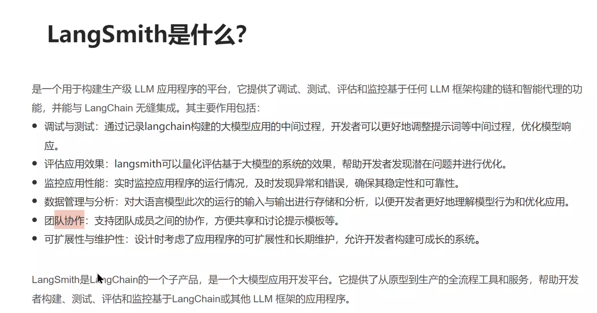
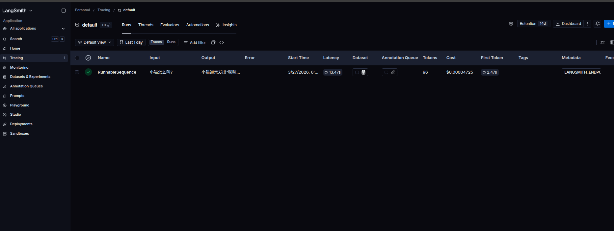
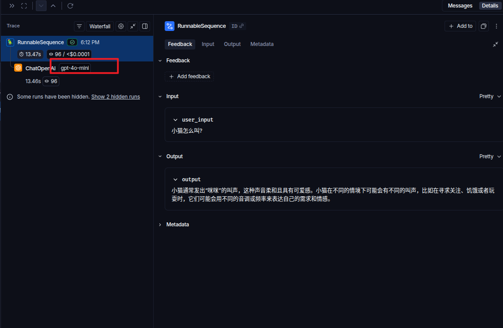
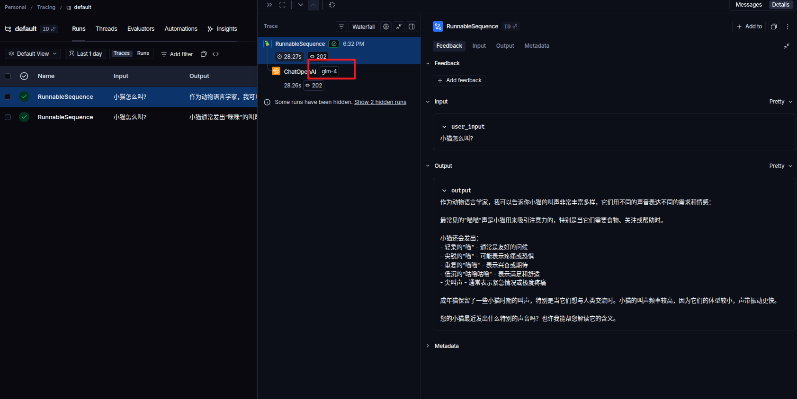

# LangSmith

[官网](https://smith.langchain.com/)  

注册后去设置里边创建key并保存




## 然后你只需要加上几个东西
```python
os.environ["LANGSMITH_TRACING"] = "true"
os.environ["LANGSMITH_ENDPOINT"] = "https://api.smith.langchain.com"
os.environ["LANGSMITH_API_KEY"] = f'{langsmith_key}'
```
其它一切正常写就行,代码如下

用openai的
```python
# @Time    : 2026/3/27 17:48
# @Author  : hero
# @File    : demo8.py

#tips:要先去langsmith注册账号并且获取自己的api_key

'''langsmith是一个用于构建生产级LLM应用程序的平台，它提供了调试，测试，评估和监控任何基于LLM框架构建的链和职能代理的功能，
并能与Langchain无缝集成
具体描述看笔记
'''


from langchain_core.output_parsers import StrOutputParser
from langchain_core.prompts import ChatPromptTemplate
from langchain_openai import ChatOpenAI
from dotenv import load_dotenv
import os
import time


load_dotenv()

openai_api_key =os.getenv('api_key')
openai_base_url =os.getenv('base_url')
langsmith_key =os.getenv('lang_smith_key')
os.environ["LANGSMITH_TRACING"] = "true"
os.environ["LANGSMITH_ENDPOINT"] = "https://api.smith.langchain.com"
os.environ["LANGSMITH_API_KEY"] = f'{langsmith_key}'
openaillm=ChatOpenAI(
    model='gpt-4o-mini',
    api_key=openai_api_key,
    base_url=openai_base_url,
    temperature=1.0
)


chat_prompt_template = ChatPromptTemplate(
    [
        ('system','你是一个动物语言学家'),
        ('user','{user_input}')
    ]
)


parser = StrOutputParser()

chain = chat_prompt_template | openaillm | parser

#tips:非流式
# res = chain.invoke(
#     {'user_input':'小猫怎么叫?'}
# )


#tips:流式
res = chain.stream(
{'user_input':'小猫怎么叫?'}
)
#important:流式返回的是生成器可迭代对象,所以可以用遍历的方式取出,但是注意生成器只能迭代一次
for r in res:
    # print(r)  #tips:打印输出的是一个个分散的,所以需要拼装
    print(r,end='',flush=True)
    time.sleep(0.15)


```

用质谱的
```python
# @Time    : 2026/3/27 18:30
# @Author  : hero
# @File    : 02质谱监控.py


#tips:要先去langsmith注册账号并且获取自己的api_key

'''langsmith是一个用于构建生产级LLM应用程序的平台，它提供了调试，测试，评估和监控任何基于LLM框架构建的链和职能代理的功能，
并能与Langchain无缝集成
具体描述看笔记
'''


from langchain_core.output_parsers import StrOutputParser
from langchain_core.prompts import ChatPromptTemplate
from langchain_openai import ChatOpenAI
from dotenv import load_dotenv
import os
import time


load_dotenv()

openai_api_key =os.getenv('zhipu_key')
openai_base_url =os.getenv('zhipu_base_url')
langsmith_key =os.getenv('lang_smith_key')
os.environ["LANGSMITH_TRACING"] = "true"
os.environ["LANGSMITH_ENDPOINT"] = "https://api.smith.langchain.com"
os.environ["LANGSMITH_API_KEY"] = f'{langsmith_key}'
openaillm=ChatOpenAI(
    model='glm-4',
    api_key=openai_api_key,
    base_url=openai_base_url,
    temperature=1.0
)


chat_prompt_template = ChatPromptTemplate(
    [
        ('system','你是一个动物语言学家'),
        ('user','{user_input}')
    ]
)


parser = StrOutputParser()

chain = chat_prompt_template | openaillm | parser


#tips:流式
res = chain.stream(
{'user_input':'小猫怎么叫?'}
)
#important:流式返回的是生成器可迭代对象,所以可以用遍历的方式取出,但是注意生成器只能迭代一次
for r in res:
    # print(r)  #tips:打印输出的是一个个分散的,所以需要拼装
    print(r,end='',flush=True)
    time.sleep(0.15)


```

## 运行完毕后去langsmith主页就可以查到记录




## langsmith本身和模型的key是无关的,只要你用了langchain来构造模型就行  

openai追踪


质谱清言追踪  



