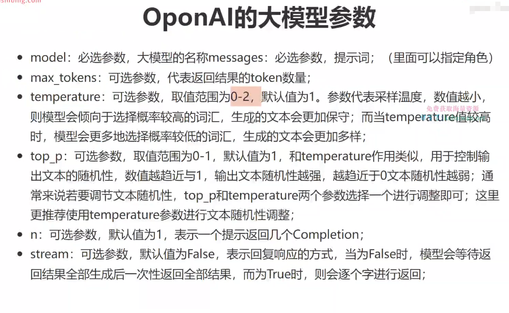
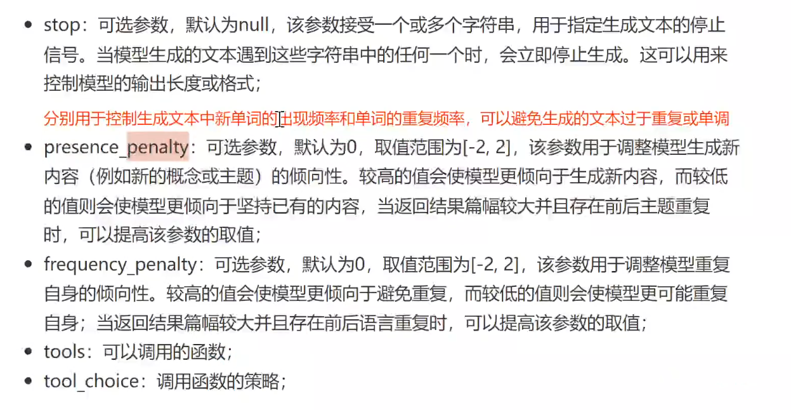

#  OpenAI大模型

## 调用基本方式
```python
from openai  import OpenAI

client=OpenAI(
	base_url='xxx',#tips:大模型接口供应商的url
	api_key='xxxxxx' #tips:自己的api_key
)

#然后就是根据不同的任务选择不同的模型了
textembedding = client.embeddings.create(
	model='text-embedding-3-small', #tips:模型名
	input='xxx' #tips:输入
).data[0].embedding

resp = client.chat.completions.create(
	model='chatgpt-4o-latest',
	messages=[ #tips:注意要传入一个可迭代对象
        {"role":"system","content":"你是一个伟大的悬疑小说家"},
        {"role":"user","content":"帮我生成一个200字左右的悬疑小说,简短又能引起遐想,没必要有结局"}
		
	]
).choices[0].message
```

##   OpenAI的大模型参数

