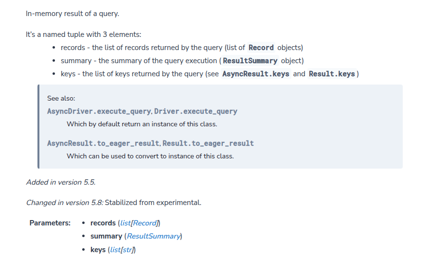
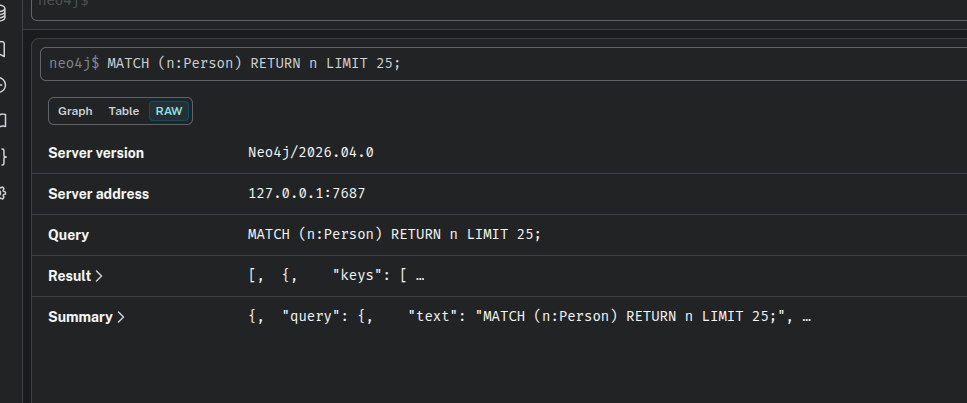

# python连接Neo4j进行增删改查


## 首先要启动并构建连接  
[官网文档](https://neo4j.com/docs/python-manual/current/query-simple/)
```python


import os
from dotenv import load_dotenv
from neo4j import GraphDatabase

load_dotenv()

password = os.getenv('neo4j_pwd')

URI = "neo4j://localhost:7687"
AUTH = ("neo4j", password)
# 通过创建 Driver 对象并提供 URL 和身份验证令牌来连接到数据库
# 获取 Driver 实例后，使用 .verify_connectivity() 方法确保可以建立有效的连接
with GraphDatabase.driver(URI, auth=AUTH) as driver:
    driver.verify_connectivity()
    print("Connection established.")
```


## 创建好Driver之后要在with字句中写增删改查操作!!

1. 创建数据
```python
with GraphDatabase.driver(URI, auth=AUTH) as driver:
    driver.verify_connectivity()
    print("Connection established.")

    # 写入数据 C
    summary=driver.execute_query(
        """
        CREATE (u1:User{name:$name})""",
        name='Niko'
    ).summary
    print(summary)
    print(f'成功创建节点{summary.counters.nodes_created},耗时{summary.result_available_after}')


    #写入数据,以字典传入参数
    params={
        'name':'minko',
        'age':18
    }
    summary = driver.execute_query(
        """
        MERGE (:User{name:$name,age:$age})""",
        params
    ).summary
```

如果对于取值有疑问的话可以打开neo4j的webui查看raw,就能知道参数为什么要这样写了


或者查看[官网](https://neo4j.com/docs/api/python-driver/current/api.html#neo4j.EagerResult)讲解




| 属性 |                                    说明                                    |
|:--:|:------------------------------------------------------------------------:|
|records |  返回包含查询结果的记录列表,每条记录是一个字典对象,如果只是单纯create的话就没有返回查询结果，自然上面的创建操作就不需要接收这个返回值  |
|summary|                          执行摘要，包含命中数、耗时、是否更新等信息                           |
|keys |                                返回结果的字段名列表                                |

## 查询数据 R
```python

  
    records, summary,keys = driver.execute_query(
        """
        MATCH (u:User{name:'Bob'})
        RETURN u.name AS name
        """

    )

    for record in records:
        print(record.data())  # tips: .data()返回一个字典

    print(f'查询{summary.query}返回的记录长度为{len(records)},耗费时间为{summary.result_available_after}')
```


## 更新数据 U 

```python
	records,summary,keys=driver.execute_query(
        """
        MATCH(u:User{name:'Bob'})
        SET u:Person ,u.hobby='dance'
        """
    )
    print(f'更新{summary.counters}\n执行{summary.query}')
```


## 删除数据 D 


``` python

    records,summary,keys = driver.execute_query(
        """
        MATCH(p:User {name:'minko')  
        DETACH DELETE p
        """
    )

    print(f'{summary.counters}')
  ```


## 补充record,summary,keys使用技巧

.data()返回字典
```python
    for record in records:
        print(record.data())  # tips: .data()返回一个字典
```